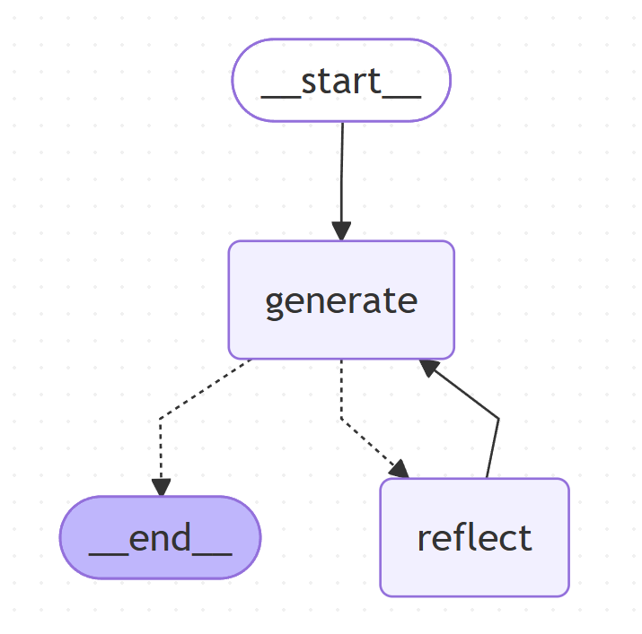

# 🤖 LangGraph Agent com Geração + Reflexão

Este projeto implementa um agente de IA utilizando **LangGraph** que segue um ciclo iterativo de:

1. ✍️ Geração de resposta  
2. 🤔 Reflexão e melhoria  

Esse processo se repete automaticamente até atingir um critério de parada.

---

## 🧠 Visão Geral

O agente funciona como um sistema de autoaperfeiçoamento:

- Gera uma resposta inicial
- Analisa criticamente essa resposta
- Melhora a resposta com base na análise
- Repete o processo

👉 Ideal para:
- Melhorar textos
- Criar conteúdo de alta qualidade
- Simular revisão humana
- Refinamento iterativo de respostas

---

## 🧱 Estrutura do Projeto

### 📦 Dependências principais

- `langchain`
- `langgraph`
- `python-dotenv`

---

## ⚙️ Como funciona

### 1. Estado do sistema

```python
class MessageGraph(TypedDict):
    messages: Annotated[list[BaseMessage], add_messages]
```

- Mantém o histórico de mensagens
- Atualizado automaticamente a cada etapa

---

### 2. Nós do Grafo

#### ✍️ Generation Node

Responsável por gerar respostas:

```python
def generation_node(state: MessageGraph):
    return {"messages": [generate_chain.invoke({"messages": state["messages"]})]}
```

---

#### 🤔 Reflection Node

Responsável por analisar e melhorar a resposta:

```python
def reflection_node(state: MessageGraph):
    res = reflection_chain.invoke({"messages": state["messages"]})
    return {"messages": [HumanMessage(content=res.content)]}
```

---

### 3. Fluxo do Grafo

```
GENERATE → REFLECT → GENERATE → REFLECT → ...
```

---

### 4. Condição de parada

```python
def should_continue(state: MessageGraph):
    if len(state["messages"]) > 6:
        return END
    return REFLECT
```

---

### 5. Construção do Grafo

```python
builder = StateGraph(state_schema=MessageGraph)

builder.add_node("generate", generation_node)
builder.add_node("reflect", reflection_node)

builder.set_entry_point("generate")

builder.add_conditional_edges(
    "generate",
    should_continue,
    path_map={"__end__": "__end__", "reflect": "reflect"}
)

builder.add_edge("reflect", "generate")

graph = builder.compile()
```

---

## 🚀 Como executar

```python
if __name__ == '__main__':
    inputs = HumanMessage(content="""
    Make this tweet better:
    @LangChainAI - newly Tool Calling feature is seriously underrated...
    """)

    result = graph.invoke(inputs)
    print(result)
```

---

## 📊 Visualizando o fluxo

```python
print(graph.get_graph().draw_mermaid())
```

---

## 🔥 Exemplo de uso

Entrada:

```
Make this tweet better:
@LangChainAI - newly Tool Calling feature is seriously underrated...
```

---

## 🧠 Conceito chave

Este projeto implementa o padrão de:

> **Self-Refinement (Auto-refinamento com IA)**

---

## 💡 Possíveis melhorias

- ✅ Adicionar score de qualidade
- ✅ Parar baseado em avaliação (não só quantidade)
- ✅ Persistir histórico em banco de dados
- ✅ Adicionar múltiplos tipos de reflexão
- ✅ Criar interface (API ou UI)

---

## 🏗️ Possíveis aplicações

- Geração de conteúdo (posts, blogs)
- Revisão automática de textos
- Code review com IA
- Assistentes corporativos
- Agentes autônomos

---

## ⚠️ Observações

- Certifique-se de configurar sua variável de ambiente:

```bash
OPENAI_API_KEY=your_key_here
```

- O projeto usa `.env` com `python-dotenv`

---

## 📌 Resumo

Este projeto demonstra como construir um agente que:

✔ Gera  
✔ Avalia  
✔ Melhora  
✔ Repete  

Tudo de forma automatizada usando IA.

---

---
config:
  flowchart:
    curve: linear
---
graph TD;
        __start__([<p>__start__</p>]):::first
        generate(generate)
        reflect(reflect)
        __end__([<p>__end__</p>]):::last
        __start__ --> generate;
        generate -.-> __end__;
        generate -.-> reflect;
        reflect --> generate;
        classDef default fill:#f2f0ff,line-height:1.2
        classDef first fill-opacity:0
        classDef last fill:#bfb6fc
https://mermaid.live/edit#pako:eNp1Ud1ugjAUfpXm7EYTYMiPuGq8mY-wq42FVDgFklJIKduc8d1XGKKJ2pD0nJzvr4cjpHWGQMG27VimteRlTmNJCBf1d1owpYeOkLRTX0iJKCUyFcsBnivWFORtt_6H9CdJWm1ISTL72DTbqds8N9vPOaWUl6rVF3iOEhXTODsX88tMIReY6tl4z69NUGaTxVBPBoJd608BiG1vJ7f1bQBiOwYwij2cj1HWNyEfyacmTrtDTjLkrBOa8FII-sQ97nJu9cu0CyzzQtOF492hDesaSHbdsLTUB-regfWPHqX3fL_kaY8BC3JVZkC16tCCClXF-haO_TQGXWCFMVBTjuliiOXJ0Bom3-u6OjNV3eUFUM5Ea7quycwbdyUzf_8CMXtD9Vp3UgMNBwWgR_gB6keBs3RX7ssiila-77mBBQegQeQEZhSF4dLzzRecLPgdPF1nFYWnP7Qxy8s
## 👨‍💻 Autor

Projeto de estudo com foco em agentes de IA e automação inteligente.
Daniel Santana
